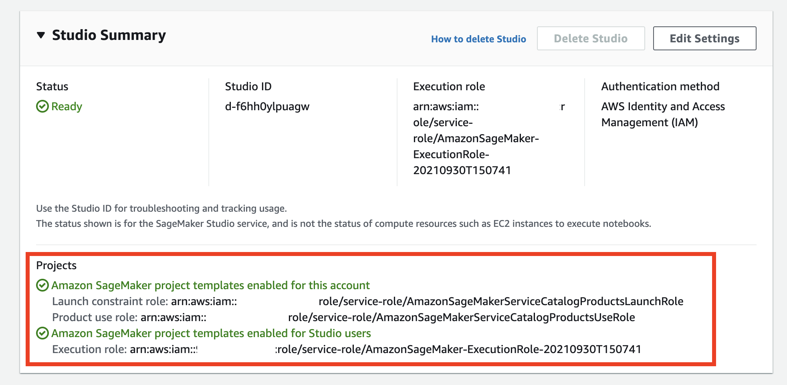
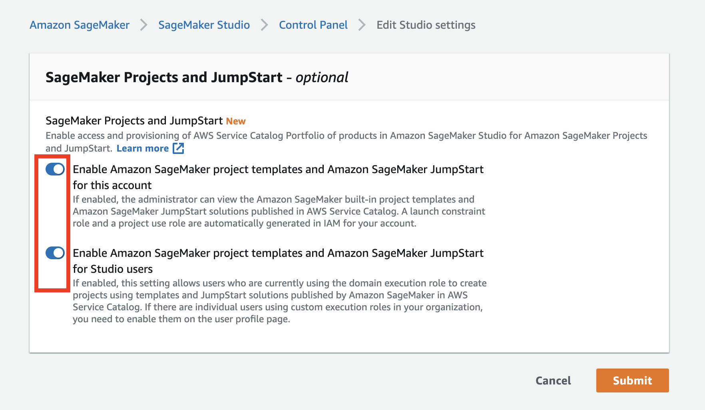

# Amazon SageMaker reusable components with SageMaker Projects
This solution shows how to deliver reusable and self-contained ML components to [Amazon SageMaker](https://aws.amazon.com/pm/sagemaker) environment using [AWS Service Catalog](https://aws.amazon.com/servicecatalog/), [AWS CloudFormation](https://aws.amazon.com/cloudformation/), [SageMaker Projects](https://docs.aws.amazon.com/sagemaker/latest/dg/sagemaker-projects-whatis.html) and [SageMaker Pipelines](https://aws.amazon.com/sagemaker/pipelines/).

Refer to the blog [Enhance your machine learning development by using a modular architecture with Amazon SageMaker projects](https://aws.amazon.com/blogs/machine-learning/enhance-your-machine-learning-development-by-using-a-modular-architecture-with-amazon-sagemaker-projects/) for more details.

## Solution overview
As an example of an ML workflow that spans several development domains, the proposed solution implements a use case of an automated pipeline for data transformation, feature extraction, and ingestion into [Amazon SageMaker Feature Store](https://aws.amazon.com/sagemaker/feature-store/).

On a high level, the workflow comprises the following steps:


1. An upstream data ingestion component uploads data file or files to an [Amazon Simple Storage Service](https://aws.amazon.com/s3/) (Amazon S3) bucket
2. The data upload event launches a data processing and transformation process
3. The data transformation process extracts, processes, and transforms features, and ingests them into a designated [feature group](https://docs.aws.amazon.com/sagemaker/latest/dg/feature-store-getting-started.html) in Feature Store

## Solution architecture
The detailed component architecture of the solution is presented in the following diagram.


A product portfolio **(1)** defines the automated Feature Store data ingestion product **(2)** together with the associated user roles that are allowed to use the portfolio and the containing products. CloudFormation templates define both the product portfolio (1) and the product (2). A CloudFormation template **(3)** contains all the resources, source code, configuration, and permissions that are needed to provision the product in your SageMaker environment.

When AWS CloudFormation deploys the product, it creates a new SageMaker project **(4)**.

The SageMaker project implements the feature ingestion workflow **(5)**. The workflow contains an [AWS Lambda](https://aws.amazon.com/lambda/) function, which is launched by an [Amazon EventBridge](https://aws.amazon.com/eventbridge/) rule each time new objects are uploaded into a monitored S3 bucket. The Lambda function starts an [Amazon SageMaker Pipeline](https://aws.amazon.com/sagemaker/pipelines/) **(6)**, which is defined and provisioned as a part of the SageMaker project. The pipeline implements data transformation and ingestion in Feature Store.

The project also provisions CI/CD automation **(7)** with an [AWS CodeCommit](https://aws.amazon.com/codecommit/) repository with source code, [AWS CodeBuild](https://aws.amazon.com/codebuild/) with a pipeline build script, and [AWS CodePipeline](https://aws.amazon.com/codepipeline/) to orchestrate the build and deployment of the SageMaker pipeline (6).

### ML pipeline
This solution implements an ML pipeline by using Amazon SageMaker Pipelines, an ML workflow creation and orchestration framework. The pipeline contains a single step with an [Amazon SageMaker Data Wrangler](https://aws.amazon.com/sagemaker/data-wrangler/) processor for data transformation and ingestion into a feature group in Feature Store. The following diagram shows a data processing pipeline implemented by this solution.


### IAM roles and permissions
The following diagram shows all the IAM roles involved and which service or resource assumes which role.


The IAM setup contains the following roles:

1. The SageMaker Service Catalog products launch role. This role calls the `iam:PassRole` API for the SageMaker Service Catalog products use role (2) and the Lambda execution role (4).
2. The SageMaker Service Catalog products use role. Project resources assume this role to perform their tasks.
3. The SageMaker execution role. Studio notebooks use this role to access all resources, including S3 buckets.
4. The Lambda execution role. The Lambda function assumes this role.
5. The Lambda function [resource policy](https://docs.aws.amazon.com/lambda/latest/dg/access-control-resource-based.html) allows EventBridge to invoke the function.

Refer to [SageMaker Studio Permissions Required to Use Projects](https://docs.aws.amazon.com/sagemaker/latest/dg/sagemaker-projects-studio-updates.html) for more details on the Studio permission setup for projects.

## Deployment
아래의 원문은 참조사히고, 저희는 SageMaker Classic Notebook 을 **로컬 개발 환경** 으로 사용하겠습니다.
- [원문] 솔루션을 배포하려면 CloudFormation 템플릿을 패키징하고, Amazon S3 버킷에 템플릿을 업로드하고, 배포 명령을 실행할 수 있는 **관리자**(또는 **고급 사용자**) 권한이 있어야 합니다.

- [원문] [AWS CLI](https://aws.amazon.com/cli/)도 있어야 합니다. 없으면 [AWS CLI 설치, 업데이트 및 제거](https://docs.aws.amazon.com/cli/latest/userguide/cli-chap-install.html)를 참조하십시오.

- 솔루션 [GitHub 리포지토리](https://github.com/aws-samples/amazon-sagemaker-reusable-components.git)를 로컬 개발 환경에 복제합니다.

솔루션 [GitHub 리포지토리](https://github.com/aws-samples/amazon-sagemaker-reusable-components.git)를 SageMaker Classic Notebook에 복제합니다.

```sh
git clone https://github.com/aws-samples/amazon-sagemaker-reusable-components-kr.git
cd amazon-sagemaker-reusable-components-kr
```


### Create SageMaker Studio
계정에 SageMaker Studio가 생성 및 구성되지 않은 경우 [Studio의 새 인스턴스 생성](https://docs.aws.amazon.com/sagemaker/latest/dg/gs-studio-onboard. HTML). 이미 Studio가 있는 경우 [SageMaker 프로젝트 포트폴리오 배포](#deploy-sagemaker-project-portfolio) 단계에서 계속할 수 있습니다.
1. [Amazon SageMaker 콘솔](https://console.aws.amazon.com/sagemaker/)을 엽니다.
1. **Amazon SageMaker Studio**를 선택합니다.

1. 구성 대화 상자에서 **표준 설정**, **AWS IAM(Identity and Access Management)**을 선택하고 계정 및 Studio 사용자에 대해 **SageMaker 프로젝트 및 JumpStart**가 활성화되어 있는지 확인합니다.


**권한** 구성에서 **새 역할 만들기**를 선택합니다. Studio IAM 역할에 대한 권한을 검토하고 필요한 경우 수정하고 수락합니다.

1. **네트워크 및 스토리지** 구성에서 Studio용 VPC 및 네트워크 액세스를 선택합니다. **VPC만** 옵션을 선택하는 경우 VPC에 인터넷 액세스 권한이 있는지 확인합니다.
- 제약 사항이 없으면 디폴트 VPC, 첫번째 subnet, 첫번째 보안 그륩을 선택 합니다.

1. **제출**을 클릭합니다.


### Deploy SageMaker project portfolio
이 솔루션에는 [SageMaker 사용자 지정 프로젝트 템플릿](https://docs.aws.amazon.com/sagemaker/latest/dg/sagemaker-projects-templates-custom.html)이 포함되어 있어 Studio, 보다 구체적으로 [SageMaker 기능 저장소](https://aws.amazon.com/sagemaker/feature-store/)로 기능 변환 및 수집 자동화를 위한 것입니다. 이 프로젝트 템플릿은 [AWS 서비스 카탈로그](https://aws.amazon.com/servicecatalog/) 제품(Product)으로 제공되며 **프로젝트** 아래 Studio **SageMaker 리소스** 메뉴에서 사용할 수 있습니다.

Studio를 시작하기 전에 필요한 모든 아티팩트를 프로비저닝하려면 다음 배포 단계를 따라야 합니다.

1. [Package CloudFormation templates](package-cfn.md)
1. Get the ARN of the SageMaker execution role:  
    a. Get the SageMaker DomainId:
    ```sh
    export SM_DOMAIN_ID=$(aws sagemaker list-domains \
        --output text --query 'Domains[0].DomainId')
    ```
    b. Get the SageMaker execution role ARN:
    ```sh
    export SM_EXECUTION_ROLE=$(aws sagemaker describe-domain \
        --domain-id $SM_DOMAIN_ID \
        --output text --query 'DefaultUserSettings.ExecutionRole')
    ```
1. Deploy AWS Service Catalog product portfolio:
```sh
S3_BUCKET_NAME=<S3 bucket name you used to package CloudFormation templates in step 1>
SC_PORTFOLIO_STACK_NAME=sm-project-sc-portfolio

aws cloudformation create-stack \
    --template-url https://s3.$AWS_DEFAULT_REGION.amazonaws.com/$S3_BUCKET_NAME/amazon-sagemaker-reusable-components/sm-project-sc-portfolio.yaml \
    --region $AWS_DEFAULT_REGION \
    --stack-name $SC_PORTFOLIO_STACK_NAME  \
    --disable-rollback \
    --capabilities CAPABILITY_NAMED_IAM \
    --parameters \
        ParameterKey=SCPortfolioPrincipalRoleArn,ParameterValue=$SM_EXECUTION_ROLE
```

Wait until CloudFormation stack is successfully deployed into your account and proceed with the next step.

### 서비스 카탈로그 런치 및 SageMaker 실행 IAM 역할에 권한 추가
AWS Service Catalog는 기본 [`AmazonSageMakerServiceCatalogProductsLaunchRole` IAM 역할](https://docs.aws.amazon.com/sagemaker/latest/dg/security-iam-awsmanpol-sc.html)을 사용하여 SageMaker 프로젝트와 함께 CloudFormation 템플릿을 시작합니다. 이 역할은 Studio 사용자에 대해 SageMaker 프로젝트를 활성화한 경우 SageMaker Studio를 프로비저닝하는 동안 자동으로 생성됩니다.

Feature Store 수집 제품을 SageMaker 프로젝트로 배포하려면 이 역할에 추가 권한이 필요합니다. 필요한 모든 권한은 [관리형 정책 리소스 `AmazonSageMakerServiceCatalogFSIngestionProductPolicy`](cfn-templates/sm-project-sc-portfolio.yaml)에 정의되어 있으며 이를 역할(`AmazonSageMakerServiceCatalogProductsLaunchRole`) 에 첨부해야 합니다.
이는  SageMaker 프로젝트 배포를 시작하기 전에 해야 합니다.

예를 들어 [CloudFormation API](https://docs.aws.amazon.com/AWSCloudFormation/latest/APIReference/API_Operations.html)를 호출하여 제공된 노트북에서 일부 코드 셀을 실행하려면 SageMaker 실행 역할에 추가 권한이 필요합니다. 이러한 권한은 [관리형 정책 리소스 `AmazonSageMakerExecutionRolePolicy`](cfn-templates/sm-project-sc-portfolio.yaml)에 정의되어 있으며 SageMaker 실행 역할에 연결되어야 합니다.

다음 CLI 명령을 실행하여 생성된 관리형 정책을 `AmazonSageMakerServiceCatalogProductsLaunchRole` 및 SageMaker 실행 IAM 역할에 연결합니다.
관리형 정책 ARN 및 SageMaker 실행 역할 이름을 검색합니다.

```sh
export SM_SC_FS_INGESTION_POLICY_ARN=$(aws cloudformation describe-stacks \
    --stack-name $SC_PORTFOLIO_STACK_NAME \
    --output text \
    --query 'Stacks[0].Outputs[?OutputKey==`FSIngestionProductPolicyArn`].OutputValue')

export SM_EXECUTION_ROLE_POLICY_ARN=$(aws cloudformation describe-stacks \
    --stack-name $SC_PORTFOLIO_STACK_NAME \
    --output text \
    --query 'Stacks[0].Outputs[?OutputKey==`AmazonSageMakerExecutionRolePolicyArn`].OutputValue')

export SM_EXECUTION_ROLE_NAME=$(aws cloudformation describe-stacks \
    --stack-name $SC_PORTFOLIO_STACK_NAME \
    --output text \
    --query 'Stacks[0].Outputs[?OutputKey==`AmazonSageMakerExecutionRoleName`].OutputValue')
```

Attach the policies to the roles:
```sh
aws iam attach-role-policy \
    --role-name AmazonSageMakerServiceCatalogProductsLaunchRole \
    --policy-arn $SM_SC_FS_INGESTION_POLICY_ARN

aws iam attach-role-policy \
    --role-name  $SM_EXECUTION_ROLE_NAME \
    --policy-arn $SM_EXECUTION_ROLE_POLICY_ARN
```

### 스튜디오 시작
Studio를 시작하려면 [SageMaker Dashboard](https://console.aws.amazon.com/sagemaker/home?#/dashboard)로 이동하여 **Open SageMaker Studio**를 클릭하고 **Status**가 다음인지 확인해야 합니다. '준비'.
**Studio 요약** 창에서 계정 및 Studio 사용자에 대해 Amazon SageMaker 프로젝트 템플릿이 활성화되어 있는지 확인합니다.




If projects are disabled, click on **Edit Settings**:


and enable the projects in the settings window, click Submit:



스튜디오 사용자가 없는 경우 SageMaker Studio 제어판에서 **사용자 추가**를 클릭합니다. 그렇지 않으면 **스튜디오 열기**를 클릭합니다.


새 스튜디오 사용자를 추가하려면 사용자 추가 패널의 [SageMaker Studio 생성](#create-sagemaker-studio) 단계에서 생성된 해당 SageMaker 실행 역할을 입력하고 제출을 클릭합니다.


사용자 프로필이 생성된 후 **Open Studio** 링크를 클릭할 수 있습니다. Studio IDE가 있는 새 브라우저 창으로 리디렉션됩니다.


Studio에서 기본 JupyterServer 애플리케이션 생성을 마칠 때까지 기다립니다.


Launcher 방문 페이지를 제시했습니다.


### 코드 리파지토리 복사 하기
제공된 노트북을 사용하려면 소스 코드 저장소를 Studio 환경에 복제해야 합니다.
**런처** 창의 Studio에서 시스템 터미널을 엽니다.


터미널에서 다음 명령을 실행합니다.
```sh
git clone https://github.com/aws-samples/amazon-sagemaker-reusable-components-kr.git
```

코드 저장소가 다운로드되어 Studio의 홈 디렉토리에 저장됩니다.
이제 파일 브라우저로 이동하여 [00-setup](notebooks/00-setup.ipynb) 노트북을 엽니다.


새 KernelGateway 앱에서 노트북 커널을 처음 시작하는 데는 약 5분이 걸립니다. 커널이 준비된 후 노트북의 추가 지침을 계속 진행합니다.

## 솔루션 둘러보기
제공된 [설정](notebooks/00-setup.ipynb) 및 [feature-store-ingest-pipeline](notebooks/01-feature-store-ingest-pipeline.ipynb) 노트북을 사용하여 모든 솔루션 단계를 실행하십시오.

제공된 노트북은 다음 구현을 안내합니다.
- [설정](노트북/00-setup.ipynb)
    - 작업 환경 설정, 데이터 업로드를 위한 S3 버킷 생성, 테스트 데이터 세트 탐색
    - 선택 사항 - 데이터 변환 및 기능 수집을 위한 Data Wrangler 흐름 생성
    - 피쳐가 저장되는 피쳐 저장소에 피쳐 그룹 생성
    - 피쳐 그룹에서 데이터 쿼리
- [피쳐 저장소 수집 파이프라인](노트북/01-feature-store-ingest-pipeline.ipynb)
    - 데이터 파이프라인이 있는 SageMaker 프로젝트 프로비저닝
    - 프로젝트 리소스 탐색
    - 모니터링되는 S3 버킷에 새 데이터를 업로드하여 데이터 파이프라인 테스트
    - Python SDK를 통해 요청 시 데이터 파이프라인 실행
    - 피쳐 그룹에서 데이터 쿼리
- [정리](노트북/99-clean-up.ipynb)
    - 프로젝트 및 프로젝트 리소스 삭제
    - 피쳐 그룹 삭제
    - 프로젝트 프로비저닝된 S3 버킷 및 S3 객체 삭제


# Clean up
To avoid charges, you must remove all project-provisioned and generated resources from your AWS account. 

1. Run all steps in the provided [clean-up notebook](notebooks/99-clean-up.ipynb)
2. Detach the managed policies from the roles:
```sh
aws iam detach-role-policy \
    --role-name AmazonSageMakerServiceCatalogProductsLaunchRole \
    --policy-arn $SM_SC_FS_INGESTION_POLICY_ARN

aws iam detach-role-policy \
    --role-name  $SM_EXECUTION_ROLE_NAME \
    --policy-arn $SM_EXECUTION_ROLE_POLICY_ARN
```
3. Delete the SageMaker product portfolio stack:
```sh
aws cloudformation delete-stack --stack-name $SC_PORTFOLIO_STACK_NAME
```
4. If you used the provided CloudFormation package and deployment stack, delete it:
```sh
aws cloudformation delete-stack --stack-name amazon-sagemaker-reusable-components-package-cfn
```

5. Delete the SageMaker Studio Domain.  
Refer to the detailed step-by-step instructions in the [Amazon SageMaker Developer Guide](https://docs.aws.amazon.com/sagemaker/latest/dg/gs-studio-delete-domain.html).


# Dataset
We use a well-known [Abalone dataset](https://www.csie.ntu.edu.tw/~cjlin/libsvmtools/datasets/regression.html#abalone) in this solution. The dataset contains 4177 rows of data, and 8 features.

Dua, D. and Graff, C. (2019). UCI Machine Learning Repository [http://archive.ics.uci.edu/ml]. Irvine, CA: University of California, School of Information and Computer Science.

You can download the dataset from [UCI website](http://archive.ics.uci.edu/ml/datasets/Abalone):
```
wget -t inf http://archive.ics.uci.edu/ml/machine-learning-databases/abalone/abalone.data
wget -t inf http://archive.ics.uci.edu/ml/machine-learning-databases/abalone/abalone.names
```

The instructions, how to download and use the dataset, are provided in the [`00-setup` notebook](notebooks/00-setup.ipynb)

# Resources
- [Automate a centralized deployment of Amazon SageMaker Studio with AWS Service Catalog](https://aws.amazon.com/blogs/machine-learning/automate-a-centralized-deployment-of-amazon-sagemaker-studio-with-aws-service-catalog/)
- [Create Amazon SageMaker projects with image building CI/CD pipelines](https://aws.amazon.com/blogs/machine-learning/create-amazon-sagemaker-projects-with-image-building-ci-cd-pipelines/)
- [Create Amazon SageMaker projects using third-party source control and Jenkins
](https://aws.amazon.com/blogs/machine-learning/create-amazon-sagemaker-projects-using-third-party-source-control-and-jenkins/)
- [GitHub public repository for Feature Store workshop](https://github.com/aws-samples/amazon-sagemaker-feature-store-end-to-end-workshop)
- [GitHub public repository for Amazon SageMaker Drift Detection](https://github.com/aws-samples/amazon-sagemaker-drift-detection)
- [Schedule an Amazon SageMaker Data Wrangler flow to process new data periodically using AWS Lambda functions](https://aws.amazon.com/blogs/machine-learning/schedule-an-amazon-sagemaker-data-wrangler-flow-to-process-new-data-periodically-using-aws-lambda-functions/)
- [Build, tune, and deploy an end-to-end churn prediction model using Amazon SageMaker Pipelines](https://aws.amazon.com/blogs/machine-learning/build-tune-and-deploy-an-end-to-end-churn-prediction-model-using-amazon-sagemaker-pipelines/)
- [Build Custom SageMaker Project Templates – Best Practices](https://aws.amazon.com/blogs/machine-learning/build-custom-sagemaker-project-templates-best-practices/)

# License
This library is licensed under the MIT-0 License. See the [LICENSE](LICENSE) file.

Copyright Amazon.com, Inc. or its affiliates. All Rights Reserved.
SPDX-License-Identifier: MIT-0